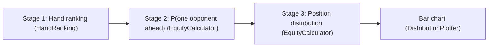

# Preflop Hand Ranking Distribution Estimator

A probability distribution that reflects a user's preflop standing, given the number of players and the user's hand.

You tell it your starting hand (for example `AKs`) and how many players are at the table. It then estimates the probability that your hand is the strongest preflop, the second strongest, and so on, and draws the result as a bar chart.

## Overview

The estimate is built in three stages. Each stage maps to one class in the code.



1. Rank every possible starting hand from strongest to weakest.
2. Compute the probability that a single opponent holds a stronger hand than you.
3. Turn that single-opponent probability into a distribution over your finishing position at a table of $N$ players.

## The Math

### Stage 1: Hand ranking

There are $169$ distinct starting hand classes in Texas Hold'em:

$$13 \text{ pairs} + 78 \text{ suited} + 78 \text{ offsuit} = 169.$$

Each class is assigned a strength rank, based on its heads-up equity, from $1$ (the best, `AA`) to $169$ (the worst, `72o`). This ordering lives in the `hands_by_Rank` table in [handRankHeadsup.py](handRankHeadsup.py). A hand is "stronger" than yours when its rank number is smaller.

### Stage 2: Probability one opponent is ahead

You hold $2$ known cards, which leaves $50$ unknown cards in the deck. A single opponent's 2-card hand is therefore one of

$$\binom{50}{2} = 1225$$

equally likely combinations. The probability that one opponent is ahead of you is the fraction of those $1225$ combinations that belong to a strictly stronger hand class:

$$p = \frac{\text{number of combos in a strictly stronger class}}{1225}.$$

**Counting combos per class.** In a full deck, each class has a fixed number of card combinations:

- pair: $\binom{4}{2} = 6$ combos
- suited: $4$ combos (one per suit)
- offsuit: $4 \times 3 = 12$ combos

**Adjusting for shared ranks.** When a stronger class shares a rank with one of your cards, fewer cards of that rank are left in the deck, so the class loses some combos. Let $n_x$ and $n_y$ be how many of your cards match the two ranks of the stronger class, and let

$$a = 4 - n_x, \qquad b = 4 - n_y$$

be the remaining cards of each rank. The combo count for that stronger class becomes:

- pair class: $\binom{a}{2} = \dfrac{a(a-1)}{2}$
- suited class: $s$
- offsuit class: $ab - s$

where $s$ is the number of suits in which both ranks are still available. This shared-rank logic is implemented in `find_winning_combos` in [probability_distribution.py](probability_distribution.py). Summing the surviving combos across every stronger class and dividing by $1225$ gives $p$.

### Stage 3: Position distribution

At a table of $N$ players you face $N - 1$ opponents. Treating each opponent as an independent trial that is "ahead of you" with probability $p$, the number $k$ of opponents who beat you follows a binomial distribution:

$$P(k \text{ opponents ahead}) = \binom{N-1}{k} p^{k} (1-p)^{N-1-k}.$$

If $k$ opponents are ahead of you, your finishing position is $k + 1$ (zero opponents ahead means you are 1st). This is computed in `standing_distribution` in [probability_distribution.py](probability_distribution.py), and the resulting probabilities are plotted by position.

## Worked Example: AKs at a 6-player table

Your hand `AKs` is rank $8$, so the strictly stronger classes are `AA`, `KK`, `QQ`, `JJ`, `TT`, `99`, and `88`.

You hold one Ace and one King, which removes one card from each of those ranks:

- `AA`: only $3$ Aces remain, so it drops from $6$ to $\binom{3}{2} = 3$ combos.
- `KK`: only $3$ Kings remain, so it also drops from $6$ to $3$ combos.
- `QQ`, `JJ`, `TT`, `99`, `88`: no shared rank, so each keeps its full $6$ combos.

Total stronger combos:

$$3 + 3 + (5 \times 6) = 36, \qquad p = \frac{36}{1225} \approx 0.0294.$$

Feeding $p \approx 0.0294$ and $N = 6$ into the binomial gives a finishing-position distribution of roughly:

- 1st: about $86.1\%$
- 2nd: about $13.0\%$
- 3rd: about $0.8\%$
- 4th and lower: near $0\%$

## Code Structure

The project follows a small object-oriented design where one class owns the data and the others depend on it.

- `HandRanking` ([handRankHeadsup.py](handRankHeadsup.py)): owns the $169$-class ranking table, the hand-to-rank lookup, and combo counts (Stage 1).
- `EquityCalculator` ([probability_distribution.py](probability_distribution.py)): computes the single-opponent probability and the position distribution (Stages 2 and 3).
- `UserInput` ([user_info.py](user_info.py)): handles the interactive prompts and validates the entered hand.
- `DistributionPlotter` ([plotter.py](plotter.py)): renders the styled bar chart of finishing position.
- `PreflopApp` ([main.py](main.py)): wires everything together.

A single `HandRanking` instance is created once and injected into the classes that need it, so the ranking tables are defined in exactly one place.

## How to Run

Create a virtual environment and install the dependencies:

```bash
python3 -m venv .venv
./.venv/bin/python -m pip install -r requirements.txt
```

Then run the program:

```bash
./.venv/bin/python main.py
```

You will be prompted for the number of players (2 to 10) and your hand combo (for example `AKs`, `AKo`, or `AA`). A bar chart of your finishing-position distribution is then displayed.

## Assumptions and Limitations

- Opponents are modeled as independent draws from the same 50-card remainder. This is a simplifying approximation, since real hands are dealt without replacement and the cards held by other opponents are not removed from the deck.
- "Beats" means holding a strictly higher preflop class rank, so exact ties are not counted as a loss.
- This measures preflop hand-class strength only.

